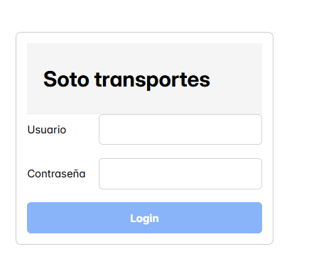
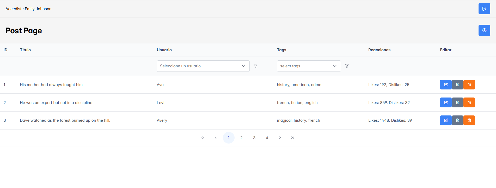
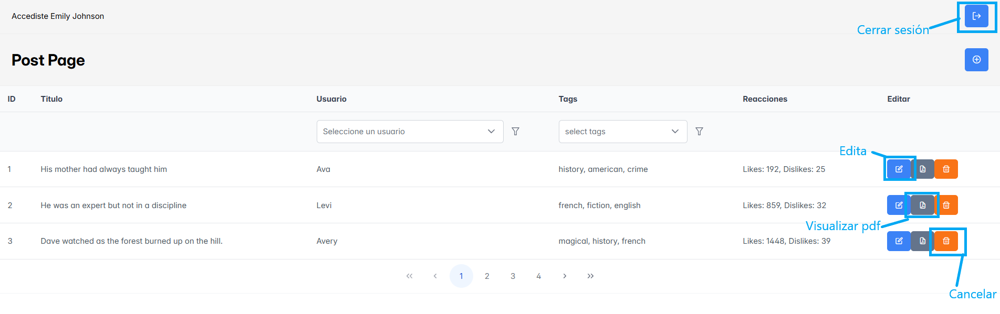
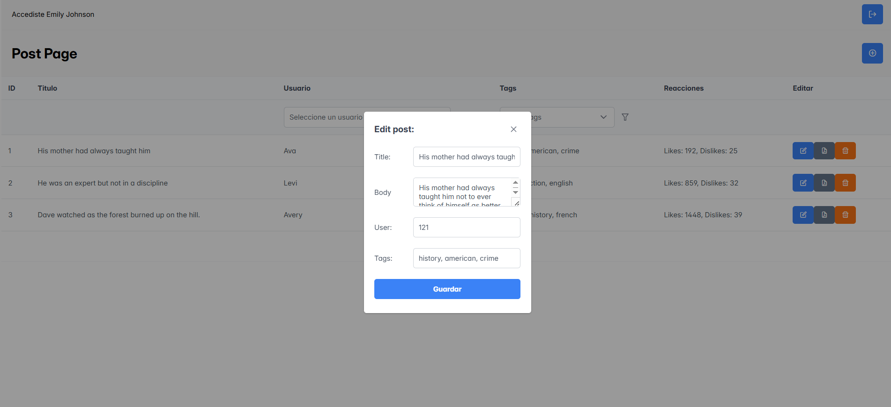

# Trasportes Soto (Prueba técnica)
## Ejecutar
Instalación: Este comando instala los paquete y dependencias del projecto.

``npm run i``

Correr en modo desarrollo: Se corre el sistema de manera local

``npm run dev``

para visualizar el sistema acceder a: 
http://localhost:5173/login

## Flujo principal
Al entrar a la ruta: http://localhost:5173/login encontrarás el login

Aquí podrás acceder las credenciales 

usuario: emilys

contraseña emilyspass

Al acceder, encontrarás la página de Post

En esta página podrás realizar acciones como:
* Editar Post
* Cancelar Post
* Visualizar Post como pdf

Estla página está sobre un layout general, con el encabezado que incluye el nombre del usuario actual, y un boton para cerrar sesión.

Al crear un nuevo registor o editar uno existente, se abrirá un formulario, al llenarlo y presionar guardar, se guarda el registro y se actualiza la tabla.

## Por hacer
* Implementar testing
* implementar custom hooks (crud post)
* cambiar campo de user en el formulario por un select
